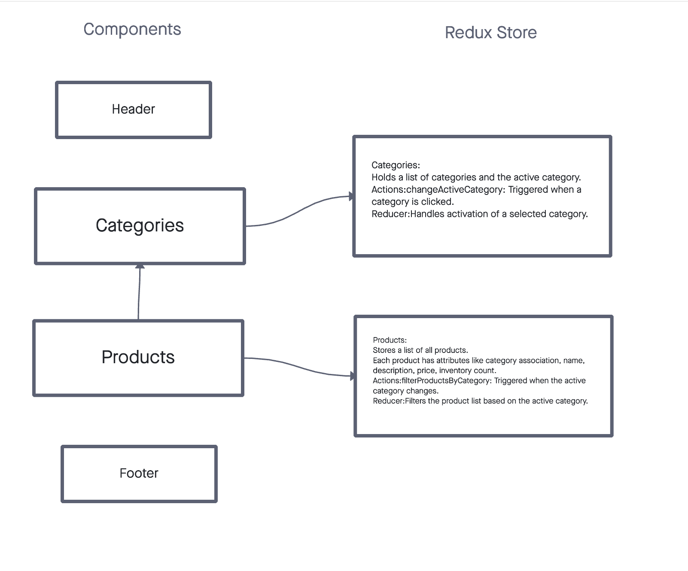

# Storefront

Storefront is a dynamic e-commerce platform built to simulate a real-world shopping experience. Developed with React and Redux, it showcases responsive design principles and state management patterns to provide a seamless user experience. Users can browse products, filter them by categories, and manage their shopping cart with intuitive interactions.

## Project Structure

The application is divided into various components, each responsible for a part of the application's functionality:

- `Header`: Displays the storefront's title and a cart indicator showing the number of items in the cart.
- `Footer`: Shows copyright and contact information.
- `Categories`: Lists all product categories. Users can select a category to filter the product list.
- `Products`: Displays products based on the selected category. Users can add products to their cart.
- `ActiveCategory`: Shows the name and description of the currently selected category.
- `SimpleCart`: A cart component that gives users a total number of the items they have added to their cart.
- `CartList`: Details each product added to the cart, including name and quantity, and allows users to remove items from the cart.
  
## URLs

  

- [PR1](https://github.com/KatKho/storefront/pull/1)
- [PR2](https://github.com/KatKho/storefront/pull/2)
- [PR3](https://github.com/KatKho/storefront/pull/3)

## Contributors

- Ekaterina Khoroshilova
- ChatGPT: Assisted with tests and documentation
